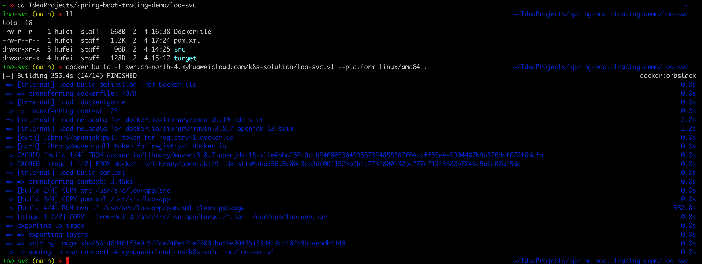
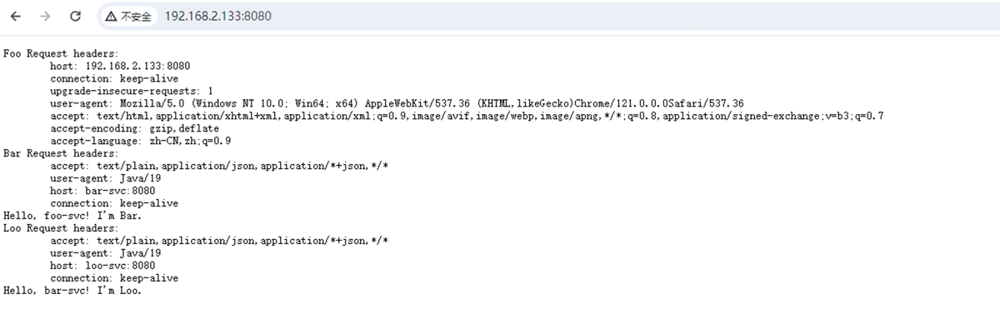

# springboot-trace-demo

springboot项目如何实现分布式Tracing。

main分支代码为初始版，未实现任何分布式跟踪。可以基于main分支进行功能定制

---

## 项目介绍

这个项目一共3个service：`foo-svc` 、`bar-svc` 、`loo-svc` 。它们的调用关系如下:

1. foo-svc 调用 bar-svc
2. bar-svc 调用 loo-svc

---

## 容器镜像制作

dockerfile文件已经写好，直接docker build即可制作镜像。



---

## 项目运行

容器化部署 运行在kubernetes集群中。部署文件请参考 kubernetes文件夹下的资源清单


该项目访问效果如下：

---
其中loadgenerator是用来访问foo-svc的。查看其日志可发现:
```bash
Foo Request headers:
	host: foo-svc
	user-agent: curl/7.81.0-DEV
	accept: */*
Bar Request headers:
	accept: text/plain,application/json,application/*+json,*/*
	user-agent: Java/19
	host: bar-svc:8080
	connection: keep-alive
Hello, foo-svc! I'm Bar.
Loo Request headers:
	accept: text/plain,application/json,application/*+json,*/*
	user-agent: Java/19
	host: loo-svc:8080
	connection: keep-alive
Hello, bar-svc! I'm Loo.
```

