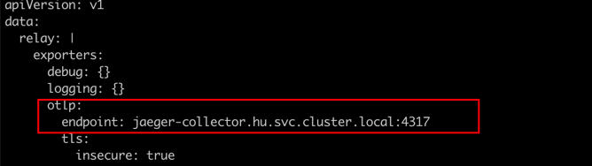
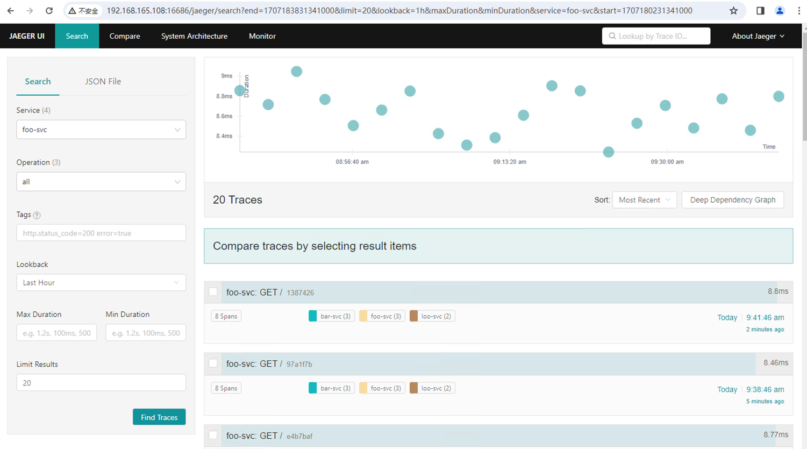
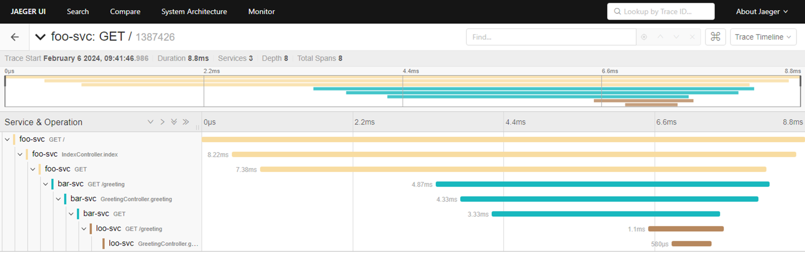

# springboot-trace-demo

1. springboot项目如何实现分布式Tracing
2. main分支代码为初始版，未实现任何分布式跟踪。可以基于main分支进行功能定制
3. tag: autoconfigure版本通过opentelemetry-java sdk 实现自动埋点，以java agent形式运行。
4. 自动埋点配置可以参考：https://github.com/open-telemetry/opentelemetry-java/tree/main/sdk-extensions/autoconfigure#tracer-provider
---

## 项目介绍

这个项目一共3个service：`foo-svc` 、`bar-svc` 、`loo-svc` 。它们的调用关系如下:

1. foo-svc 调用 bar-svc
2. bar-svc 调用 loo-svc

---

## 容器镜像制作

dockerfile文件已经写好，直接docker build即可制作镜像。


---

## 项目运行

容器化部署 运行在kubernetes集群中。部署文件请参考 kubernetes文件夹下的资源清单


该项目访问效果如下：

---
其中loadgenerator是用来访问foo-svc的。查看其日志可发现:
```bash
Foo Request headers:
	host: foo-svc
	user-agent: curl/7.81.0-DEV
	accept: */*
Bar Request headers:
	accept: text/plain,application/json,application/*+json,*/*
	user-agent: Java/19
	host: bar-svc:8080
	connection: keep-alive
Hello, foo-svc! I'm Bar.
Loo Request headers:
	accept: text/plain,application/json,application/*+json,*/*
	user-agent: Java/19
	host: loo-svc:8080
	connection: keep-alive
Hello, bar-svc! I'm Loo.
```

---
## 安装opentelemetry-collector和jaeger
otel-java sdk导出器配置需要为otel的服务地址，我们需要在集群中安装otel。
同时otel的链路数据也需要在jaeger中进行展示。

1. 建议通过helm 方式安装otel
2. jeager 安装方式参考官方: https://www.jaegertracing.io/docs/1.53/deployment/

---
## 关键配置
1. jaeger中需要开放otlp协议的端口4317(grpc)或4318(http)端口
2. otel 需要配置导出器地址为jaeger的4317端口

---
## 效果
微服务和otel部署状态

查看jaeger UI 查看调用信息，调用信息可以实现方法级

